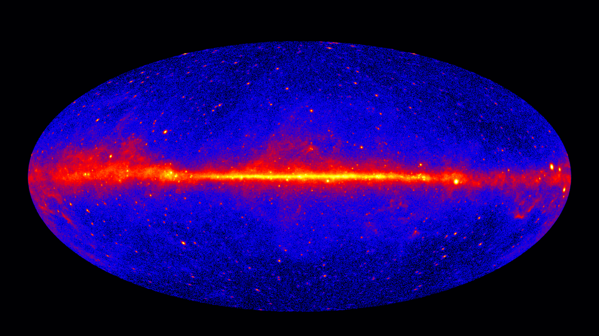
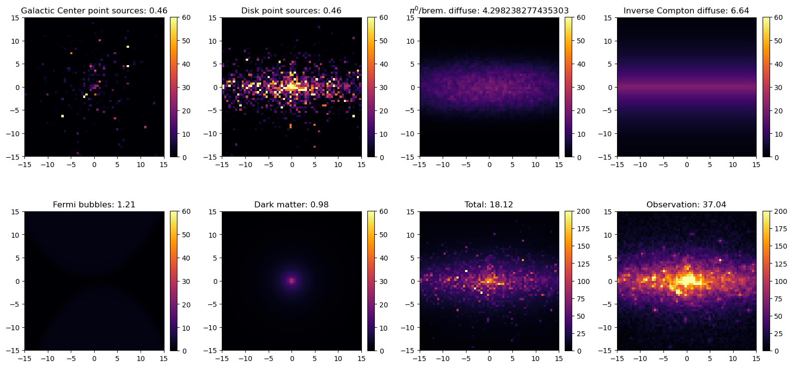

# Galactic Center GeV Excess (GCE)

### Have we discovered dark matter in the center of the Milky Way?

We know dark matter (DM) makes up 85% of the universe's mass, but we still have not identified its fundamental components. One very well-motivated possibility is that it is a *weakly interacting massive particle (WIMP)* -- a particle with a mass between 1-1000 times that of a proton. If that's the case, DM in our galaxy could annihilate with itself and produce gamma rays. The gamma-ray signal from DM annihilation should be strongest in the center of the galaxy, where the DM density is the largest.

That's why there was a huge amount of excitement when the Fermi Large Area Telescope (LAT) observed an unexpected excess of gamma-rays coming from the Galactic Center. While this excess can be explained by DM, debate has raged for the past 13 years over whether astrophysics can explain it instead. The main astrophysical explanation is *millisecond pulsars (MSPs)*. These rapidly-rotating remnants of massive stars have extremely strong magnetic fields, which accelerate particles to high energies, causing them to emit gamma rays. The brightest ones appear as *point sources* -- small spots in the gamma-ray sky. Gas emission and other mechanisms also produce gamma rays.

### What is the main issue?

It is extremely difficult to determine how well the DM's parameters can be measured while properly averaging over possible point source configurations. Critically, there may be thousands of point sources in the Galactic Center. Typical statistical tools like Markov-chain Monte Carlo (MCMC) require modeling *every single point source*. This is hard because first of all we don't know how many point sources are present! Second, many of them are very dim. This makes them hard to measure individually, but they still contribute strongly to the gamma-ray emission when considered all together. Third, there is a labeling problem. We can switch which point sources we label as "1" and "2" without changing the observation. This means the posterior has n! modes -- one for each point source.

As a result, different analyses make different assumptions to enable application of tools like MCMC. This makes it challenging to compare analyses and figure out whether we're really seeing dark matter.

The goal of this problem is to infer the dark matter and astrophysical contributions from 2D images of the gamma-ray sky around the Galactic Center.

### What is the potential solution to this problem?

New ML tools make it possible to make measurements directly from images, and perform the difficult marginalization over thousands of parameters.

### What data is used? 
This notebook contains a hand-crafted simulator to generate images of the Galactic Center. Running the simulator's `sample()` method generates a `dict` containing a random sample from the model.

The simulator models the following emission components with entries in the `sample`:

-  Point sources distributed symmetrically around the Galactic Center. The number of sources generated is `sample["n_ps_gc"]`. The positions and fluxes of the point sources are randomly sampled each time the simulator is run. `samples["flux_ps_gc"]` contains the point source contribution in each pixel.

-  Point sources distributed in the galactic disk. The number of sources generated is `sample["n_ps_disk"]`. `samples["flux_ps_disk"]` contains the point source contribution in each pixel.

-  Emission tracing the gas distribution, arising from e.g. $\pi^0  \to  \gamma\gamma$ decay and bremsstrahlung. This component is modeled as a Gaussian process, with values in `sample["template_pi0"]` and normalization `sample["A_pi0"]`.

-  Inverse Compton emission. This comes from high-energy cosmic rays Compton upscattering low-energy cosmic microwave background (CMB) and starlight photons to higher energies. It is smoother that that previous emission components. Its normalization is `sample["A_ic"]`.

-  Fermi bubbles. These are two huge, faint lobes extending far above and below the galactic plane. This component's normalization is `sample["A_bubbles"]`.

-  **Dark matter.** The emission is spherically-symmetric and sharply peaked towards the Galactic Center. Its normalization is `sample["A_dm"]`, and is related to the strength with which DM self-annihilates.

All normalizations `A_x` range between 0 and 1.

To generate an observation, the simulator samples all the afformentioned components to get `sample["mu"]`. It applies a point spread function that slightly blurs the image. Since Fermi LAT observations consist of the number of photons recorded in a given pixel in the detector, it samples the observation from a Poisson distribution with mean equal to this blurred image. **The final observation is `sample["img"]`.**

### References
-  [Possible Evidence For Dark Matter Annihilation In The Inner Milky Way From The Fermi Gamma Ray Space Telescope](https://arxiv.org/abs/0910.2998) -- the first paper to find the excess

-  [Indirect Detection of Dark Matter in the Galaxy](https://arxiv.org/abs/2006.00513) -- particularly section 5 for a recent overview of the Galactic Center excess

-  [U-Net: Convolutional Networks for Biomedical Image Segmentation](https://arxiv.org/abs/1505.04597)

-  [Likelihood-free MCMC with Amortized Approximate Ratio Estimators](https://arxiv.org/abs/1903.04057)

